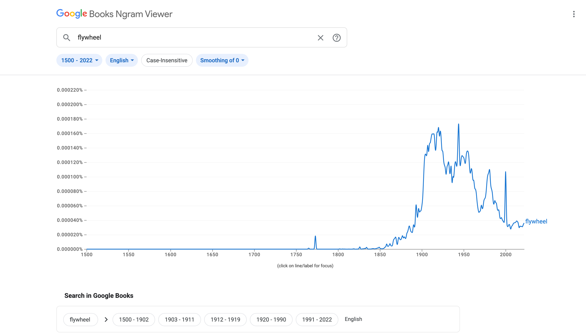

# Graveyard

Material cut from <cite>Copy that, words we didn’t choose</cite> before CAKE conf
2026.

*Cut, don’t delete.*

These are not TODOs. They’re preserved for reference, reuse, or future
versions.

---

## Cuts from the final talk

### Perfection isn’t the goal

> Perfection isn’t the goal.
>
> Intention is.

The polished antithesis risks demonstrating the inherited formula the
talk critiques, and the final Copy / Question / Edit sequence already
lands intention through choice.

### Café reaction caption

> Too bad the visuals aren’t as good as their coffee. Hot AI slop served
> daily. 🔥

The image now goes directly to “Maybe the problem isn’t that it looks
bad. It’s that it looks done.” The joke was useful as an impulsive
reaction, but the sharper transition gives the audience more credit and
keeps “slop” out of the main sequence.

### Book Doug / archive excursion

> One minute, they are a treasured record of human thought. The next,
> they are twelve searchable megabytes.

**Senior Legacy Media Completion Specialist**

That’s Book Doug’s job. Scan. Destroy. Bye-bye book.

*\[This Is Fine GIF\]*

Funny and memorable, but it opened a second argument about AI consuming
the archive between “The models read everything” and the talk’s argument
about reading, rendering, and choice.

### Janitorial work / custodial era

> Call it prompting. ~~Vibe writing.~~ Cleaning up.

**Janitorial work**

We became the janitors of AI output. Cleaning up what was already made.

> UX work should not, however, be reduced to janitorial work forever.
>
> — Anna Kaley and Raluca Budiu, <cite>[The Custodial Era of UX: Cleaning Up After AI](https://www.nngroup.com/articles/ai-ux-debt/), NN/g, 2026</cite>

It created another conceptual branch before Tighten. “Don’t start by
polishing it / Ask whether it should exist first” carries the useful
part more directly.

### Eating your own slop

> Turn rough thinking into polished work.
>
> — <cite>[Claude App Store description](https://apps.apple.com/us/app/claude-by-anthropic/id6473753684), Anthropic, 2026</cite>

The quote remains in the main talk under **Rough thinking**. Only the
heading was cut; it made the talk more combative and repeated “slop”
after the café example.

### Presentable graveyard

> Things I chose not to keep.

The idea is now embodied by this file instead of explained in the main
ending.

### At the end of the day

> At the end of the day, broadly speaking,
>
> I have a lot to say about the words we inherit, repeat, and either
> overthink or overuse.

A useful callback joke, but it stepped on the final thesis before the
thank-you slide.

---

## Other cuts

### Gray goo

The model produces “leverage.” That output trains the next model. Which
produces more “leverage.” Which trains the next one.

Self-replicating. Consuming. Nobody in control.

### Words AI overuses

*tapestry · kaleidoscope · delve · unpack · foster · leverage · seamless
· robust · groundbreaking · transformative · nuanced · pivotal · crucial
· streamline · embark · resonate · illuminate · underscore · it is worth
noting · in conclusion · not only... but also · it’s important to note ·
as an AI...*

Useful evidence, but too easy to turn into a blacklist. The main talk
now argues that there are no forbidden words; there are words we didn’t
choose.

### Alt text and em dash

> Alt text is a paragraph. — Dave Rupert, 2020

The flywheel alt-text examples and the “model can’t help itself” em-dash
joke lived here. Funny, but they pulled the talk back toward detecting
AI mannerisms after the argument had moved toward judgment.

### The Punisher: One Last Kill

Entertainment UI example of an em dash arriving in subtitle metadata.
Keep the photo if you take it; the example is now optional rather than
part of the main sequence.

### Claude feedback UI

“How is Claude doing this session? Bad · Fine · Good”

A good language observation, but another side investigation when the
story needs to move toward work-before-words.

### Twain

> “I didn’t have time to write a short letter, so I wrote a long one
> instead.”

*(Every AI response, ever.)*

— Mark Twain

### Orwell

> “Let the meaning choose the word, and not the other way about.”
>
> — George Orwell, <cite>[Politics and the English Language](https://www.orwellfoundation.com/the-orwell-foundation/orwell/essays-and-other-works/politics-and-the-english-language/), 1946</cite>

Strong and on-theme. Cut from the main sequence to reduce the stack of
authorities; restore if the talk needs a historical bridge between Torre
and Sutnar.

### Ethan Marcotte

> “I am very upset I had to write any of this, but here we both are.”
>
> — Ethan Marcotte, <cite>[AI](https://ethanmarcotte.com/ai/), updated June 11, 2026</cite>

Strong voice example. Cut because the scratchpad/process sequence now
carries the argument in the speaker’s own voice.

### Polishing Poland

We’re in Poland.

Polishing is a glossy finish. It makes things look done when they’re
not.

Prefer matte.

### The tests

  Test                  Ask
  --------------------- -------------------------------------------
  Say it out loud       Would I say this to a person?
  Underline it          Is this word mine?
  Close your eyes       Can I picture it?
  Try the contraction   Who told me formal was better?
  Read as your user     Does this help them, or just sound right?

Useful practical material, but it read like a conclusion before the
actual conclusion. Revisit only if the talk needs a photographable
handout slide.

### Things worth copying

-   Say it out loud. If you stumble, the word isn’t yours.
-   Underline every word that isn’t yours. Treat it like a misspelling.
-   Try the contraction. Can’t, not cannot.
-   Cut, don’t delete. Remix before you start over.
-   Ask: did I choose this, or did it choose me?
-   Join the content-first club. Membership is free.

Cut because several rules became more prescriptive than the talk’s final
argument about judgment and intention.

### Scott Kubie: swoop and poop

> “Just what it sounds like — somebody swoops in and takes a shit all
> over everything you’ve written.”
>
> — Scott Kubie, <cite>*Writing for Designers*</cite>

### Corpus delicti

*noun* Law

The facts and circumstances constituting a breach of a law. Concrete
evidence of a crime, such as a corpse.

### Late roles / expert examples

Writer. Editor. ???

Nolan Lawson: “I would probably just chuck a Chrome trace at Claude Code
and have it suggest improvements.”

Thomas and Erin Ptacek: “Never take a word it suggests, and never let it
encourage you.”

---

## Full democratization sequence

## Movable type.

The printer controlled the tool and the output.

## Desktop publishing.

The designer got the tool. The typesetter’s craft didn’t come with it.
*\[Image: Varityper 820 callback\]*

## “If all people doing desktop publishing were doctors, we would all be dead!”

— Massimo Vignelli, 1991

## “Type design has become a victim of its own success.”

— Zuzana Licko, <cite>Emigre, 2025</cite>

## They were both right.

The tool democratized. The judgment didn’t.

## The web.

Everyone got publishing. The editor’s craft didn’t come with it.

## AI writing tools.

Everyone got a draft. The writer’s craft didn’t come with it.

## Some people forgot the words exist.

*(Andrej Karpathy, 2025: “fully give in to the vibes... and forget that
the code even exists.”)*

## Each step democratized access.

None of them democratized judgment.

The final deck keeps the compressed access → judgment idea. This
expanded historical sequence stayed cut.

---

## “Cannot” isn’t robotic. It’s formal.

The convention of avoiding contractions goes back centuries: legal
documents, academic papers, technical documentation.

It stayed contained there, until software absorbed it. Then models
trained on that documentation absorbed it too.

---

## “Cannot” and “can’t” are both correct.

“Can’t” is the one that sounds like it’s breaking a rule.

Even though it’s the one people actually say.

Replaced by the documentation-versus-conversation sequence, which makes
the same point more directly with real strings.

---

## Sign in.

---

## Log in.

---

## One is borrowed from human convention.

## One was coined for a machine.

Neither is wrong. But they don’t feel the same.

Cut because the distinction was interesting but not strong enough for
dedicated slides in the 30-minute talk.

---

## Give me a concrete example.

`You cannot —`

`Sorry.`

`You can’t.`

---

## That’s not a typo. That’s the talk.

Orphaned without the cannot/can’t stumble setup.

---

## Read.

---

## Read.

---

## Red.

---

## Same letters. Different meaning.

## Context is everything.

---

## Words carry meaning beyond the word itself.

For native speakers and everyone else.

Cut because the sequence was interesting but too thin for four slides.

---

## Performative emotion.

*”We’re excited to announce...”*

Are you though?

---

## Self-congratulatory.

*”Powerful, flexible, and easy to use.”*

*(Everyone says this. It means nothing.)*

The useful part survived in the Vale rules rather than as standalone
exhibits.

---

## The linter as a human practice

## before it becomes a tool.

Cut as a vague transition.

---

## Writer + copyeditor.

Like designers who code. Like developers who design.

We wear more hats now. AI doesn’t remove that responsibility. It raises
the stakes.

Cut when the access/judgment sequence took over this job.

---

## “If you don’t have a good answer, cut it.”

— Scott Kubie

---

## “Eventually, you have to say:

## ‘This is the text. These are the words.

## We are moving forward with these words.’”

— Scott Kubie

Cut to avoid stacking too many authority quotes.

## Robotix (1984)

*\[Video clip: 20 seconds\]*

“Who gives you robots to command?”

---

## Who gives you language to repeat?

---

## Early Robotix packaging

Something 101: basic, modular, unnamed.

---

## After the cartoon, each module got a name.

Something personal.

Note: this is where system voice starts to sound more human: with
product voice, with brand voice.

---

## ¯\_(ツ)\_/¯

We all do this. The CAKE conf website does this.

*”Dive into topics, sharpen your skills, and leave with practical tools
you can put to work immediately.”*

It’s everywhere. It’s all of us. That’s why we’re here.

---

## Three concrete tightenings.

*\[Live demo: run Vale on three real strings\]*

Before → After

---

## The Ngram slide.

“Flywheel” near zero until \~1850. Peaks around 1920. Flatlines in books
by 2022. But explodes in Slack, decks, and UI strings.

The medium the data can’t see.

Cut because the VariTyper and tractor images already make the
machine-metaphor point without adding a data detour.

---

## Kraftwerk, The Man-Machine (1978)

Humans performing as machines: deliberately, as art.

We’re doing it by accident.

---

## Little Boots: Stuck on Repeat (2009)

The lyric performs the thing it describes.

---

## ezCater billboard

“We feed LLMs (Large Lunch Meetings).”

*\[Image: billboard photo\]*

---

## Um. Uh. Ah.

Cut because the filler-word analogy opened another branch after the talk
had moved toward choice and judgment.

---

## Did you choose them, or did they choose you?
