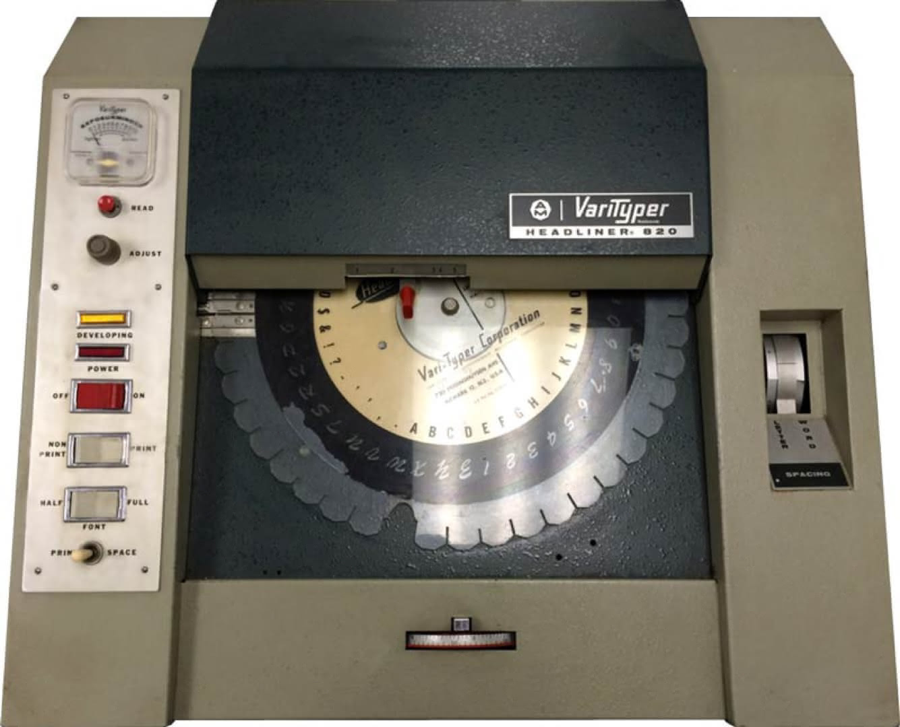
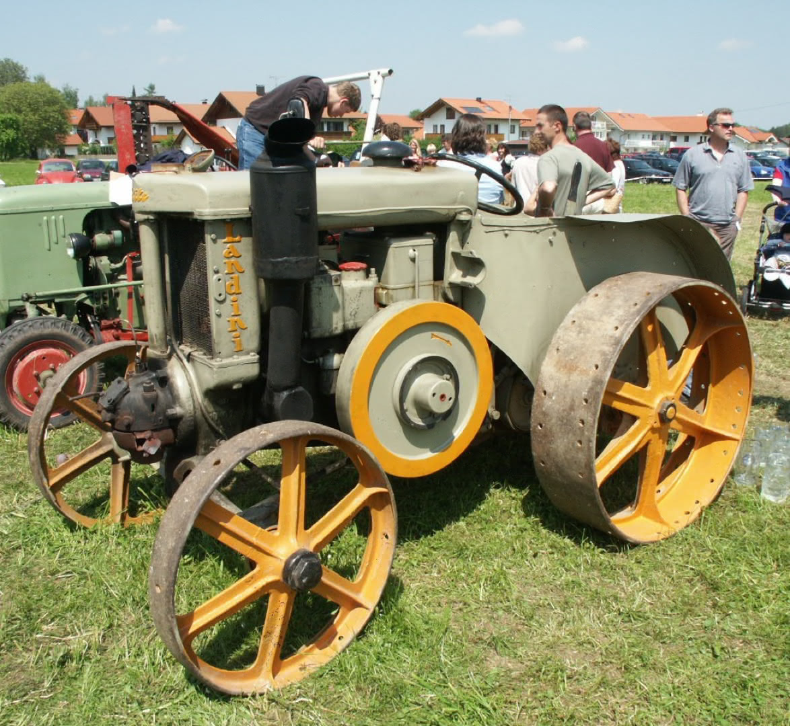
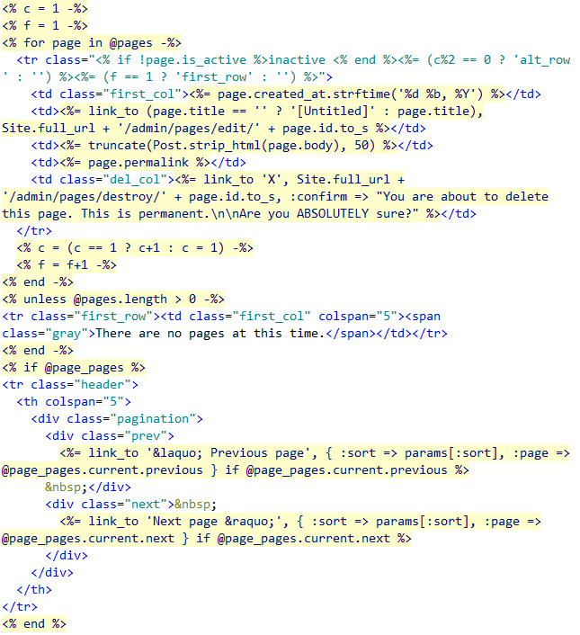
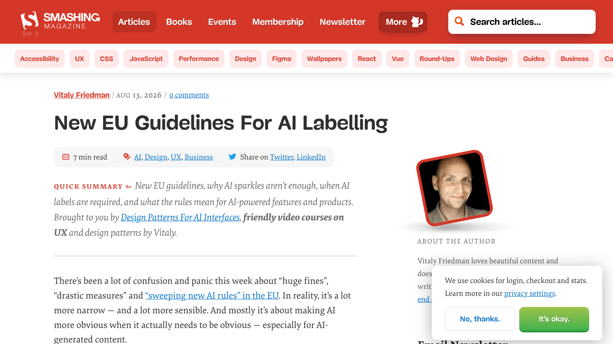
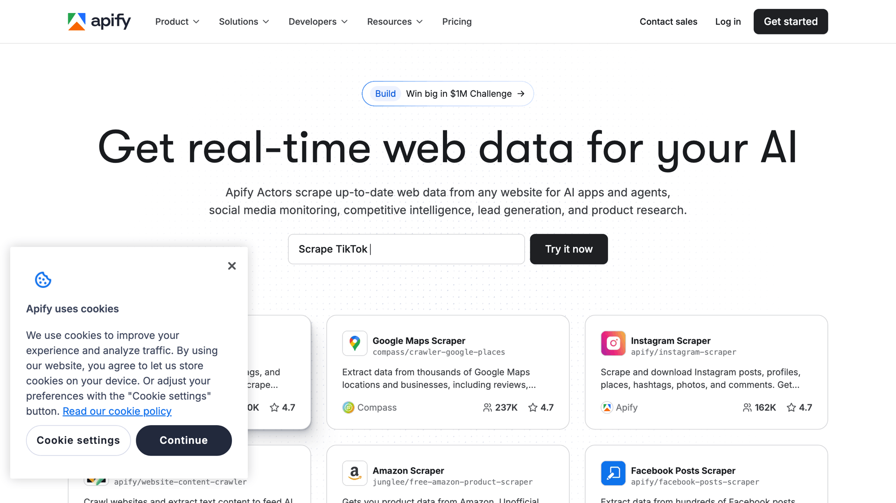
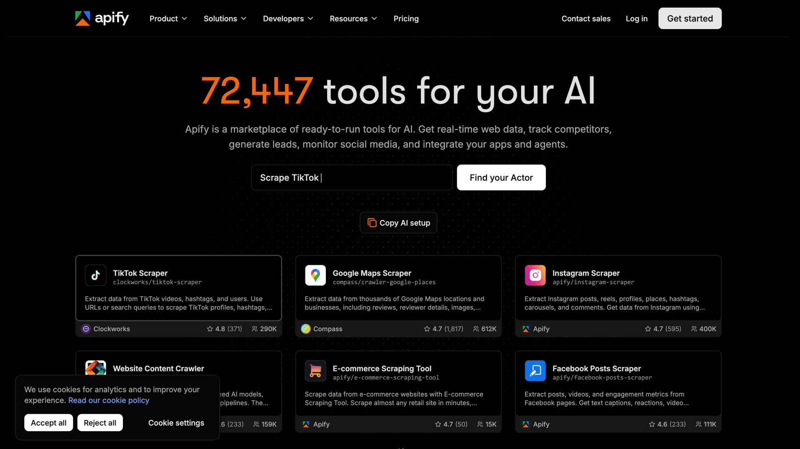
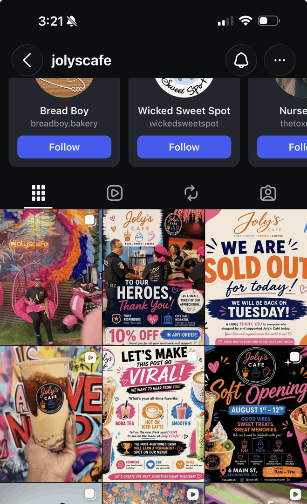

CAKE conf 2026

# Copy that, words we didn’t choose

**Justin Gagne**, Senior UX Writer at Apify

---

<!-- _class: center -->

## Thinking…

---

<!-- _class: center -->

## Fathoming…

---

<!-- _class: center -->

## Musing…

---

<!-- _class: center -->

## Crystallizing…

---

<!-- _class: center -->

## Polishing…

---

Thinking… fathoming… musing… crystallizing… polishing… leveraging… streamlining… unpacking…
move the needle… circle back… at the end of the day…

---

## Who writes like this?

---

## Close your eyes

---

## Picture a flywheel

When’s the last time you touched one, used one, or even saw one?

---

## This is my flywheel…

---

<!-- _class: visual -->

<small>VariTyper Headliner 820, circa 1966. It set headlines from 12 to 90 points using interchangeable font discs. <cite>[Prepressure](https://www.prepressure.com/prepress/history/events-1966)</cite></small>

---

## And this is a flywheel…

---

<!-- _class: visual -->

<small>Vintage Landini tractor with a large exposed metal flywheel. <cite>[Wikipedia](<https://en.wikipedia.org/wiki/Flywheel#/media/File:Landini_VL30(Italien)2.JPG>)</cite></small>

---

## Oh, it’s a business metaphor, too?

**We all have a context window.** Mine is clearly type-centric.

---

## Let’s start with a concrete example…

---

<!-- _class: visual -->

<small>Hotel Forum, Kraków. Construction: 1978–88. Photo by Błażej Pindor, 2003. <cite>[WhiteMAD](https://www.whitemad.pl/en/krakows-forum-hotel-polish-brutalism-at-its-best/), 2024</cite></small>

---

## Another ~~concrete~~ example

An example is already concrete. *That’s why it’s an example.* 🤷

---

## Copy that, words we didn’t choose

That’s what I want to talk about.

The words that arrive before we remember choosing them.

---

## Dzień dobry, hej, hello

I’m Justin Gagne.

I’m a UX writer, designer, builder, and educator. I’m a content-first club member.
I believe writing is designing, and I notice words like a designer spots bad kerning.
Once you see it, you can’t stop. I appreciate well-written copy. I see you (thank you).

---

## Dzień dobry, hej, hello

I’m Justin Gagne.

~~I’m a UX writer, designer, builder, and educator.~~ **I write, design, build, and teach.** ~~I’m a content-first club member. I believe writing is designing, and I notice words like a designer spots bad kerning. Once you see it, you can’t stop. I appreciate well-written copy.~~ **Writing is designing. I see you (thank you).**

---

## About that flywheel…

- A colleague said “flywheel” in a meeting.
- Someone else said it at an offsite.
- A presenter I’d never met said it in a webinar.

Suddenly, a machine part was load-bearing vocabulary in three conversations.

---

## Load-bearing vocabulary

Did any of us choose it?

---

## You speak like where you work

Aquent: **wheelhouse**. Apify: **flywheel**.

Both borrowed from machines. Both arrived with the job.

---

## You write like what you read

> How the model behaves is really a function of what kind of things it was exposed to.
>
> — Sean Goedecke (GitHub), <cite>[Why AI loves em dashes, with Sean Goedecke](https://www.quickanddirtytips.com/transcripts/grammar-girl/e1157/), Grammar Girl, 2026</cite>

---

## Models write like what they’re exposed to

So do we.

---

## We didn’t learn to sound like this from the robots

They learned it from us.

---

## We learned what professional writing sounded like…

---

## Documentation

- The changes were saved successfully
- The user is required to sign in
- The request cannot be processed at this time

---

## But the context changed

There was a person on the other side.

---

## Now we’re talking to someone

- Your changes are saved
- Sign in to continue
- Something went wrong. Try again.

---

## tl;dr (too long; didn’t read)

We share what we haven’t read.

---

## The models read everything

Do we?

---

## You write like what you read

What happens when we don’t?

---

## What does the reader see?

> An LLM paragraph will register to much of your audience not as writing but as output.
>
> — <cite>[A Final Ward](https://sockpuppet.org/blog/2026/09/17/how-to-write-with-an-llm/), 2026</cite>

---

## Sometimes we don’t read because we don’t have to

We skim. We scan. We skip.

---

## Tag soup

HTML + JavaScript + server-side code + HTML + JavaScript + …

---

<!-- _class: visual -->

<small><cite>[Web Development as Tag Soup](https://blog.codinghorror.com/web-development-as-tag-soup/), Jeff Atwood, 2008</cite></small>

---

## The browser renders it anyway

It looks fine.

Until you have to understand what’s underneath.

---

## We’re rendering it anyway

It looks fine. It reads fine.

Until the words stop sounding like your own.

---

## Don’t start by polishing it

Ask whether it should exist first.

---

## `chore: tighten comment prose for economy of language`

I wrote this. 🤦

---

## I was going to say:

You can’t tighten a sentence.

---

## But you can feel it

Tighten?

Maybe if we were still setting hot type.

Shorten? Trim? Condense? Simplify? Hmm…

---

## Tighten isn’t wrong

The question isn’t whether I wrote it.

It’s whether I chose it.

---

## There are no banned words

There are words we didn’t choose.

---

## Cookies

Some words are ours to choose.

Some aren’t.

---

<!-- _class: visual -->

<small>Smashing Magazine cookie notice. <cite>[Smashing Magazine](https://www.smashingmagazine.com/2026/08/eu-guidelines-ai-labelling/), 2026</cite></small>

---

<!-- _class: visual -->

<small>Previous Apify cookie notice. <cite>[Apify](https://apify.com/)</cite></small>

---

<!-- _class: visual -->

<small>Revised Apify cookie notice. <cite>[Apify](https://apify.com/)</cite></small>

---

## Which choices were actually ours?

Constraints still leave choices.

Know which constraints you’re responding to.

---

## Content-first is still the right approach

The problem used to be getting content in early enough.

Now copy can arrive before the content exists.

---

<!-- _class: visual -->

<small>A friend sent me this café’s Instagram feed.</small>

---

<!-- _class: visual -->

<small><cite>On Fire</cite> by KC Green, 2013. [GIF via GIPHY](https://media.giphy.com/media/NTur7XlVDUdqM/giphy.gif)</small>

---

## Good enough

Maybe the problem isn’t that it looks bad.

It’s that it looks done.

---

## The laser printer made bad design look done

The model makes bad copy look done.

The quality isn’t in the output.

It’s in the judgment that produced it.

---

## We’ve been asking whether we chose the words

There’s a bigger question.

---

## Did we have something to say before we started writing?

---

## Before you write

1. **Reporter** finds something out.
2. **Editor** decides what matters.
3. **Writer** makes it understandable.

---

## AI writing

We skipped to the writer.

---

## We gave everyone a writer

Nobody automatically became a reporter.

---

## Writing is thinking

(Not my words.)

---

> The designer must think first, work later.
>
> — Ladislav Sutnar, <cite>*Visual Design in Action*, 1961 ([quoted in Eye](https://eyemagazine.com/feature/article/sutnar))</cite>

---

> I use words as material.
>
> — Nicole Fenton, <cite>[Words as Material](https://www.nicolefenton.com/words-as-material/), 2015</cite>

---

> Used too early, it collapses uncertainty before ideas have earned their shape. Used a bit later, it becomes a powerful partner, reacting to intent instead of defining it.
>
> — José Torre, <cite>[A Sharp Tool Can Still Ruin the Cut](https://www.doc.cc/articles/a-sharp-tool-can-still-ruin-the-cut), DOC, 2025</cite>

---

## ~~Polishing~~

Almost done thinking…

`___________________`

<small>Your word here</small>

---

> Turn rough ideas into polished work.
>
> — <cite>Claude App Store description, Anthropic, 2026</cite>

---

## You are out of free messages until 3:00 PM

Have lunch.

Go for a walk.

Keep thinking.

---

## Writing needs somewhere to be unfinished

Scratchpad. Clipboard. Notes. Another file.

Cut it. Move it. Keep it.

Don’t delete it just because it isn’t right *here*.

---

## Linting

Vale is a prose linter. It flags things worth another look.

It’s a diagnostic, not a decision.

You still have to choose.

---

## Some rules we built

- **MixedRegister**: formal and informal in the same string
- **PerformativeEmotion**: “we’re excited to announce”
- **RoboticPhrases**: “delve into,” “leverage,” “streamline”

---

## Every step widened access

Movable type → desktop publishing → the web → AI

Access to the tools isn’t the same as judgment.

---

## Reporter. Editor. Writer

The tool can support all three.

It can also make it easier to skip all three.

---

## Copy that

- The words we inherit
- The words we’re given
- The words the model gives back

---

## Question that

- Where did it come from?
- What does it mean here?
- Did I choose it?

---

## Edit that

Keep it. Change it. Cut it.

**Choose.**

---

<!-- _class: center -->

# The words don’t have to be yours.

---

<!-- _class: center -->

# The choice does.

---

## Dziękuję, dzięki, thanks 🍰

**Copy that, words we didn’t choose**
Justin Gagne

- Slides: [github.com/jgagne/copy-that](https://github.com/jgagne/copy-that)
- [linkedin.com/in/justingagne](https://linkedin.com/in/justingagne)
